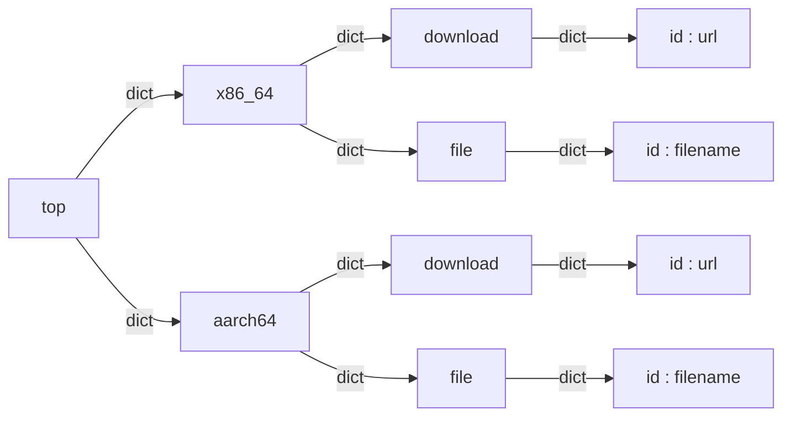
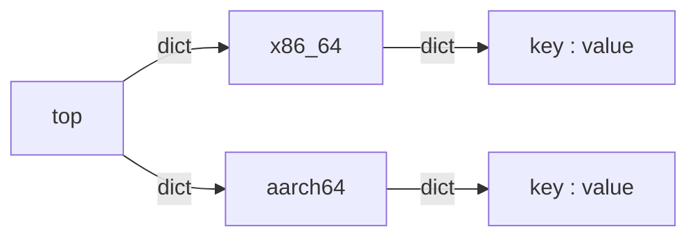

# EulerInit文档


[TOC]

## 概述

EulerInit是一个便捷的镜像转换工具，用于将openEuler系统自动化从openEuler的iso制作出各种公有云的虚拟机镜像。原理是利用Python shell调用QEMU，在本地启动文件服务器用于传输相关安装包到虚拟机，并使用kickstart文件运行自动化安装。

目前兼容情况如下：

|         | 阿里云 | 华为云 | 腾讯云 |
| ------- | :----: | :----: | :----: |
| x86_64  |   √    |   √    |   √    |
| aarch64 |   x    |   √    |   x    |

EulerInit在宿主机Windows 10和Ubuntu 20.04上通过了openEuler-20.03-LTS镜像生成测试。

## 准备工作

EulerInit依赖*qemu-img*，*qemu-system-x86_64*和*qemu-system-aarch64*等虚拟化工具，且需要将这些工具加入环境变量。

windows系统：

从[此处](https://www.qemu.org/download/)下载QEMU的Windows版本，并人工将qemu安装目录加入环境变量。

Linux系统：

例如Ubuntu下可以利用apt-get或yum安装*qemu-system-x86*，*qemu-system-arm*和*qemu-utils*。

其他发行版可以自行寻找相似软件包。

检查是否安装成功：

```
# Windows
qemu-system-x86_64.exe -version
qemu-system-aarch64.exe -version
qemu-img.exe -V

# Linux
qemu-system-x86_64 -version
qemu-system-aarch64 -version
qemu-img -V

# output
QEMU emulator version 5.0.0 (v5.0.0-11810-g8846fa22bb-dirty)
Copyright (c) 2003-2020 Fabrice Bellard and the QEMU Project developers
QEMU emulator version 5.0.0 (v5.0.0-11810-g8846fa22bb-dirty)
Copyright (c) 2003-2020 Fabrice Bellard and the QEMU Project developers
qemu-img version 5.0.0 (v5.0.0-11810-g8846fa22bb-dirty)
Copyright (c) 2003-2020 Fabrice Bellard and the QEMU Project developers
```

除此之外，EulerInit依赖以下Python软件包，由requirments.txt指定。

若使用pip安装EulerInit，它们将自动一并安装（需要联网环境）：

```
# 用于相关文件的下载
requests>=2.24.0
# 用于ISO文件的读取
pycdlib>=1.10.0
# 用于命令行工具的创建
click>=7.1.2
```

## 实际安装

因为EulerInit是标准化Python wheel格式，安装EulerInit非常简单：

* 如果你已经获得了wheel安装包，可以直接利用pip安装：

  ```shell
  pip install EulerInit-0.1-py3-none-any.whl
  ```

* 如果你试图从源码安装，可以使用如下命令：

  ```shell
  python setup.py bdist_wheel
  pip install dist/EulerInit-0.1-py3-none-any.whl
  ```

在源码中，额外提供了Windows安装脚本install.bat，Windows环境下可直接运行安装。


## 基本使用

如果您只需要进行基础性的镜像转换，请使用如下基本命令在默认参数下进行生成：

阿里云通用计算(x86_64)：

```
EulerInit -m ali path/to/x86_64/iso/file
```

腾讯云通用计算(x86_64)：

```
EulerInit -m tencent path/to/x86_64/iso/file
```

华为云通用计算(x86_64):

```
EulerInit -m huawei path/to/x86_64/iso/file
```

华为云鲲鹏计算(aarch64):

```
EulerInit -m huawei path/to/aarch64/iso/file
```

在默认参数下，生成的镜像文件将遵循以下特征描述：

| 参数     | 描述              |
| -------- | ----------------- |
| 文件名   | virtual.img       |
| 输出路径 | ./tmp/virtual.img |
| 大小     | 40GB              |
| 格式     | raw               |
| 密码     | openEuler@123456  |


## 命令详解

```
Usage: EulerInit [OPTIONS] ISO

Options:
  -m, --mode [huawei|tencent|ali|template|script]
                                  Target cloud platform to generate.
                                  [required]

  -p, --path PATH                 Directory for temporary files and output
                                  image(default : ./tmp).

  -s, --script PATH               Python script convertor defined by user(if
                                  mode is "script").

  -t, --template PATH             Template files directory defined by user(if
                                  mode is "template" or "script").

  -i, --img TEXT                  Output img filename(default : virtual.img).
  -f, --format TEXT               Output img format(default : raw).
  -q, --quiet                     Quiet mode(not output anything)
  --system [x86_64|aarch64|auto]  System architecture of ISO image
                                  file(default : auto, "auto" is to fetch from
                                  ISO filename).

  --passwd TEXT                   default password of image root(default :
                                  openEuler@123456).

  --size TEXT                     Image file size to create(default : 40G).
  -h, --help                      Show this message and exit.
```

具体的options描述如下：

| 指令     | 取值       | 描述                                       | 默认             | 强制 | 备注                                       |
| -------- | ---------- | ------------------------------------------ | ---------------- | ---- | ------------------------------------------ |
| mode     | huawei     | 使用为华为云配置的模板文件安装镜像         | 无               | 是   |                                            |
|          | tencent    | 使用为腾讯云配置的模板文件安装镜像         |                  |      |                                            |
|          | ali        | 使用为阿里云配置的模板文件安装镜像         |                  |      |                                            |
|          | template   | 使用用户自定义的模板文件安装镜像           |                  |      |                                            |
|          | script     | 使用用户自定义的模板文件和安装脚本安装镜像 |                  |      | 要求同时设置ALLOW_USER_SCRIPT=True环境变量 |
| path     | TEXT[PATH] | 指定的输出文件夹                           | ./tmp            | 否   |                                            |
| script   | TEXT[PATH] | 指定的安装脚本Python文件                   | 无               | 否   | 仅在mode为script时有效                     |
| template | TEXT[PATH] | 指定的模板文件夹                           | 无               | 否   | 仅在mode为script和template时有效           |
| img      | TEXT       | 输出镜像文件名                             | virtual.img      | 否   |                                            |
| format   | TEXT       | 输出镜像格式                               | raw              | 否   | 不做类型检查，必须是qemu-img允许的格式     |
| quiet    |            | 安静模式                                   |                  | 否   |                                            |
| system   | x86_64     | ISO文件为x86_64平台                        | auto             | 否   |                                            |
|          | aarch64    | ISO文件为aarch64平台                       |                  |      |                                            |
|          | auto       | 自动检测                                   |                  |      | ISO文件名必须包含x86_64或aarch64之一       |
| passwd   | TEXT       | 输出镜像文件root用户密码                   | openEuler@123456 | 否   |                                            |
| version  | TEXT       | ISO文件版本号                              | auto             | 否   |                                            |
|          | auto       | 自动检测                                   |                  |      | ISO文件名必须包含版本号                    |
| size     | TEXT       | 输出镜像文件大小                           |                  | 否   | 不做类型检查，必须是qemu-img允许的格式     |
| help     |            | 显示帮助                                   |                  | 否   |                                            |


## 用户拓展

如果需要兼容更多公有云平台，或进行其他的自定义安装，EulerInit提供了两种拓展方式：

### 模板拓展

EulerInit利用template模板文件定义了安装流程的细节，其中包含了文件下载，QEMU调用命令，kickstart引导文件和其它部分，这些模板文件被被放在模板文件夹下。在运行过程中，EulerInit将会拷贝这个文件夹中的内容到输出文件夹，并在输出文件夹下启动本地文件服务器，以供虚拟机安装过程中使用。

EulerInit运行默认参数时，将会使用EulerInit/Convertor/template中指定的模板文件。但是，EulerInit也允许用户指定自己的template模板文件。

用户使用如下指令指定自定义模板文件夹：

```shell
EulerInit -m template -t path/to/template/directory ...
```

用户构建自定义模板文件夹时，文件夹所包含文件必须符合以下规范，其中指定名称的文件必须要存在且不可改名。在部分自定义模板文件中，支持使用在执行时确定的**符号替换列表**，具体写法将在文件规范中描述：

| 文件名        | 描述                                                         | 符号替换 |
| ------------- | ------------------------------------------------------------ | -------- |
| files.json    | 定义了文件下载与命名规则                                     | 无       |
| qemu.json     | 定义了QEMU调用命令                                           | 有       |
| ks.cfg        | 预置的kickstart安装引导脚本                                  | 有       |
| [Other files] | 其他相关文件，如cloud-init所使用的cloud.cfg，在其他文件中被使用 |          |

***

file.json中定义了文件下载与命名规则，文件符合json规范。可参考Convertor/template/XXX/下的同名文件，具体格式描述如下：



在对应的ISO文件平台下，EulerInit将会在读取file.json后，根据top节点下相应平台节点的键值对信息，获得需要下载的文件地址和文件名，并执行下载过程。需要注意的是，**如果在输出文件夹下已有同名文件，EulerInit默认文件内容正确不进行检查和下载工作**，当用户网络较差不适合进行下载时，可以利用这一点事先准备好需要的文件以跳过下载。

***

qemu.json中定义了QEMU模拟器调用命令，文件符合json规范。可参考Convertor/template/XXX/下的同名文件，具体格式描述如下：



其中key-value为自定义键值对，key为字符串，将被转换成QEMU option被加入QEMU模拟器命令中，value可以有三种格式，描述如下：

| value格式     | 描述                                                         |
| ------------- | ------------------------------------------------------------ |
| str           | 以字符串形式被转换成"- key value"加入命令                    |
| int           | 以整数形式被转换成"- key value"加入命令                      |
| list[str/int] | 以字符串或整数形式被转换成"-key value1 -key value2 -key value3 ..."加入命令 |

*备注：如需单独option样式命令如"-q"，可以使用 ```key : ''``` 格式如```'q' : '```*。

在对应的ISO文件平台下，EulerInit将会在读取qemu.json后，根据top节点下相应平台节点的键值对信息，获得QEMU模拟器调用时的命令集合，并转换成实际的调用命令。

qemu.json文件支持**符号替换列表**，用户在编写自定义模板文件时，可以使用如下符号标记，在程序执行时，这些标记将被自动替换为相应内容：

| 符号           | 内容                           | 取值            |
| -------------- | ------------------------------ | --------------- |
| {system}       | ISO镜像文件对应平台            | x86_64或aarch64 |
| {img_path}     | ISO镜像文件路径                | TEXT[PATH]      |
| {machine}      | QEMU虚拟机器类型               | pc或virt        |
| {vmlinuz_path} | vmlinuz文件路径                | TEXT[PATH]      |
| {initrd_path}  | initrd.img文件路径             | TEXT[PATH]      |
| {bios_path}    | QEMU_EFI.fd文件路径            | TEXT[PATH]      |
| {kernel_args}  | 从grub.cfg获得的原始kernel参数 | TEXT            |


***

ks.cfg为kickstart自动化引导启动脚本，该文件将在运行QEMU安装时被提供。除了支持[标准kickstart语法](https://access.redhat.com/documentation/en-us/red_hat_enterprise_linux/7/html/installation_guide/sect-kickstart-syntax#sect-kickstart-onerror)，ks.cfg文件还支持**符号替换列表**，用户在编写自定义模板文件时，可以使用如下符号标记，在程序执行时，这些标记将被自动替换为相应内容：

| 符号             | 内容                                                         | 取值    |
| ---------------- | ------------------------------------------------------------ | ------- |
| is_x86_64_pound  | 当ISO镜像文件对应平台为x86_64时替换为'#'，否则替换为空字符串 | '#'或'' |
| is_aarch64_pound | 当ISO镜像文件对应平台为aarch64时替换为'#'，否则替换为空字符串 | '#'或'' |
| passwd           | 输出镜像文件root用户密码                                     | TEXT    |
| version          | ISO文件版本号                                                | TEXT    |


### 脚本拓展

**注意：脚本拓展模式将会执行用户给定的脚本，因此可能会造成代码任意执行漏洞。为尽量避免这一点，在命令行工具中，要求用户定义环境变量EULERINIT_ALLOW_SCRIPT为True才可以使用脚本拓展，否则程序会报错并抛出PermissionError。**

EulerInit利用Convertor定义了安装流程的基础指令。Convertor类定义在.py文件中，其中定义了以下几个基本方法：

| 方法       | 描述                                     |
| ---------- | ---------------------------------------- |
| setup      | 设置相关参数                             |
| prepare    | 准备安装所需文件                         |
| serverUp   | 启动文件服务器                           |
| install    | 执行QEMU安装流程(分配空间和实际安装)     |
| serverDown | 关闭文件服务器                           |
| output     | 执行镜像生成后续工作，如格式转换或重命名 |

EulerInit运行默认参数时，将会使用EulerInit/Convertor/GeneralConvert.py中的Convertor类。但是，EulerInit也允许用户指定自己的Convertor类。

用户使用如下指令指定自定义Convertor类，需要注意的是，自定义Convertor类时，也需要自定义template模板文件：

```shell
EulerInit -m script -s path/to/Convertor.py -t path/to/template/directory ...
```

***

上述全部方法将在entry.py中被依次调用，如果用户利用entry.py中的script模式调用自定义脚本，则必须实现以上方法

用户在自定义Convertor类时，建议继承BaseConvertor类，利用虚函数的检查，确保以上方法都已经实现。当然，如果只需要修改少数方法，也可以继承GeneralConvertor以使用其中部分预定义方法。


## 已知问题

EulerInit在生成阿里云镜像时，由于阿里云本身兼容性问题，无法支持从控制台初始化密码或者修改密码。用户可以考虑：

* 临时使用生成镜像时的密码，远程登录后在命令行利用`passwd`等命令修改密码
* 通过阿里云的[配置实例自定义数据](https://help.aliyun.com/document_detail/108461.html?spm=a2c4g.11186623.6.689.831e1bf9jDdplh)功能，编写在启动时自动执行的shell脚本以修改密码


## 参考内容

用户在编写自定义模板以进行模板拓展和脚本拓展时，对于模板可能会包含的文件格式，可以参考以下内容

1. kickstart文件规范参见Red Hat Document的[kickstart部分](https://access.redhat.com/documentation/en-us/red_hat_enterprise_linux/7/html/installation_guide/sect-kickstart-syntax#sect-kickstart-onerror)
2. cloud.cfg文件规范参见[cloud-init Document](https://cloudinit.readthedocs.io/en/latest/)

